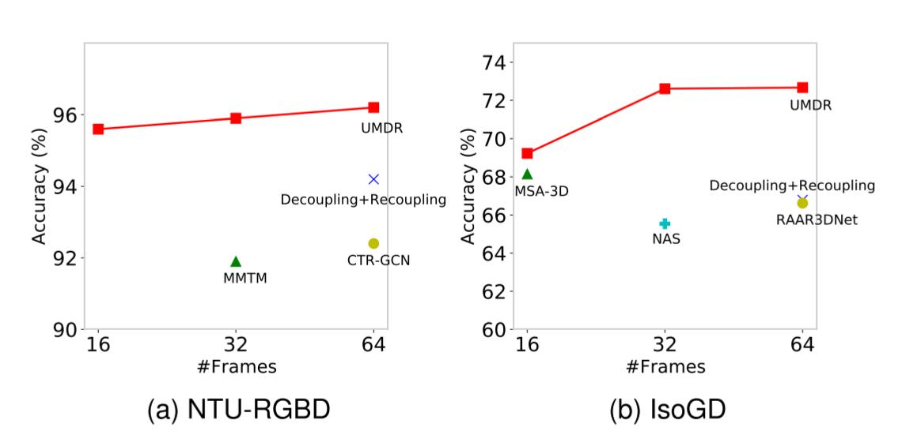
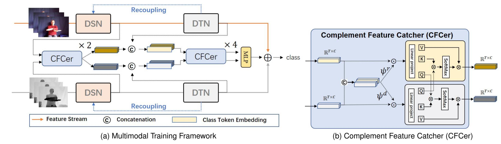
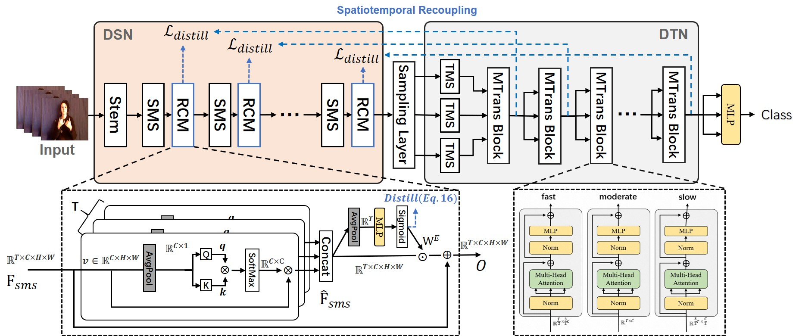

# A Unified Multimodal *De-* and *Re*-coupling Framework for RGB-D Motion Recognition [[arxiv](https://arxiv.org/abs/2211.09146)] 

<p align="center">
   
  <!--  -->

  The proposed method (UMDR) outperforms a number of state-of-the-art methods on both action and gesture datasets.
</p>

## 1. Requirements
This is a PyTorch implementation of our paper. 
torch>=1.7.0; torchvision>=0.8.0; Visdom(optional)

Data prepare: dataset with the following folder structure:

```
│NTURGBD/
├──dataset_splits/
│  ├── @CS
│  │   ├── train.txt
                video name               total frames    label
│  │   │    ├──S001C001P001R001A001_rgb      103          0 
│  │   │    ├──S001C001P001R001A004_rgb      99           3 
│  │   │    ├──...... 
│  │   ├── valid.txt
│  ├── @CV
│  │   ├── train.txt
│  │   ├── valid.txt
├──Frames/
│  │   ├── S001C002P001R001A002_rgb
│  │   │   ├──000000.jpg
│  │   │   ├──000001.jpg
│  │   │   ├──......
├──nturgb+d_depth_masked/
│  │   ├── S001C002P001R001A002
│  │   │   ├──MDepth-00000000.png
│  │   │   ├──MDepth-00000001.png
│  │   │   ├──......
```
It is important to note due to the relatively high resolution of the RGB video in the NTU dataset, instead of directly resizing the video frames from the original resolution (1280x960) to 320x240, we first crop an object-centric ROI area (640x480)  for each frame via the provided mask images, and then resize it to 320x240 for training and testing. Then resize it to 320x240 for training and testing. Please refer to data/data_preprose.py for the related data preprocessing codes.

## 2. Methodology
<p align="center">
  
  
</p>
 We propose to decouple and recouple spatiotemporal representation for RGB-D-based motion recognition. The Figure in the first line illustrates the proposed multi-modal spatiotemporal representation learning framework. The Figure in the second line shows the learning of decoupling and multi-stage recoupling saptiotemporal representation from a unimodal data.

## 3. Train and Evaluate
All of our models except NTU-RGBD are pre-trained on the [20BN Jester V1 dataset](https://www.kaggle.com/toxicmender/20bn-jester). 
### Unimodal Training
Take training an RGB model with 8 GPUs on the NTU-RGBD dataset as an example,

```bash
# type: M(rgb), K(depth); sample-duration: the length of the video clip;  smprob: hyperparameter  $\rho$; mixup: hyperparameter  $\alpha_{m}$; shufflemix: $\alpha_{s}$; intar-fatcer: Controls the temporal resolution of each sub-branch in DTN (default: set 2 when sample-duration=16/32;  set 4 when sample-duration=64).

python -m torch.distributed.launch --nproc_per_node=8 --master_port=1234 --use_env train.py --config config/NTU.yml --data /path/to/Dataset/NTU-RGBD/frames --splits /path/to/Dataset/NTU-RGBD/dataset_splits/@CS/ --save ./output_dir/ --batch-size 16  --sample-duration 32 \
--smprob 0.2 --mixup 0.8 --shufflemix 0.3 --epochs 100 --distill 0.2 --type M --intar-fatcer 2 
```

### Cross-modal Fusion
```bash
# scc-depth: number of CFCer used in spatial domain. tcc-depth: number of CFCer used in temporal domain.
python -m torch.distributed.launch --nproc_per_node=8 --master_port=1234 --use_env train.py --config config/NTU.yml --data /path/to/Dataset/NTU-RGBD/frames --splits /path/to/Dataset/NTU-RGBD/dataset_splits/@CS/ --save ./output_dir/ --batch-size 16 --sample-duration 32 \
--smprob 0.2 --mixup 0.8 --shufflemix 0.3 --epochs 100 --distill 0.0 --intar-fatcer 2 \
--FusionNet cs32 --lr 0.01 --sched step --opt sgd --decay-epochs 10 --scc-depth 2 --tcc-depth 4
```

### Evaluation
```bash
python -m torch.distributed.launch --nproc_per_node=8 --master_port=1234 --use_env train.py --config config/NTU.yml --data /path/to/Dataset/NTU-RGBD/frames --splits /path/to/Dataset/NTU-RGBD/dataset_splits/@CS/  --batch-size 16 --sample-duration 32 --eval_only --resume /path/to/model_best.pth.tar 
```
## 4. Models Download
<table>
  <tr>
    <th>Dataset</th>
    <th>Modality</th>
    <th>#Frames</th>
    <th>Accuracy</th>
    <th>Download</th>
  </tr> 
   <tr>
    <td>NTU-RGBD(CS)</td>
    <td>RGB</td>
    <td>16/32/64</td>
    <td>92.0/92.2/92.9</td>
    <td><a href="https://drive.google.com/drive/folders/1z0pvQlN31I4aKTaCDKbAmkwT7WO29MTO?usp=sharing">Google Drive</a></td>
  </tr>
    <tr>
    <td>NTU-RGBD(CS)</td>
    <td>Depth</td>
    <td>16/32/64</td>
    <td>94.5/94.8/95.0</td>
    <td><a href="https://drive.google.com/drive/folders/1z0pvQlN31I4aKTaCDKbAmkwT7WO29MTO?usp=sharing">Google Drive</a></td>
  </tr>
  <tr>
    <td>NTU-RGBD(CS)</td>
    <td>RGB-D</td>
    <td>16/32/64</td>
    <td>95.6/95.9/96.2</td>
    <td><a href="https://drive.google.com/drive/folders/1z0pvQlN31I4aKTaCDKbAmkwT7WO29MTO?usp=sharing">Google Drive</a></td>
  </tr>
  
  <tr>
    <td>NTU-RGBD(CV)</td>
    <td>RGB</td>
    <td>16/32/64</td>
    <td>95.3/95.8/96.3</td>
    <td><a href="https://drive.google.com/drive/folders/1z0pvQlN31I4aKTaCDKbAmkwT7WO29MTO?usp=sharing">Google Drive</a></td>
  </tr>
    <tr>
    <td>NTU-RGBD(CV)</td>
    <td>Depth</td>
    <td>16/32/64</td>
    <td>95.4/95.9/96.5</td>
    <td><a href="https://drive.google.com/drive/folders/1z0pvQlN31I4aKTaCDKbAmkwT7WO29MTO?usp=sharing">Google Drive</a></td>
  </tr>
    <tr>
    <td>NTU-RGBD(CV)</td>
    <td>RGB-D</td>
    <td>16/32/64</td>
    <td>97.5/97.8/98.0</td>
    <td><a href="https://drive.google.com/drive/folders/1z0pvQlN31I4aKTaCDKbAmkwT7WO29MTO?usp=sharing">Google Drive</a></td>
  </tr>
  
  <tr>
    <td>IsoGD</td>
    <td>RGB</td>
    <td>16/32/64</td>
    <td>60.6/63.7/64.4</td>
    <td><a href="https://drive.google.com/drive/folders/1uhZS9QlYIMSH9d_2rfutC1UK3YBt8Teu?usp=sharing">Google Drive</a></td>
  </tr>
  <tr>
    <td>IsoGD</td>
    <td>Depth</td>
    <td>16/32/64</td>
    <td>63.4/64.6/65.5</td>
    <td><a href="https://drive.google.com/drive/folders/1uhZS9QlYIMSH9d_2rfutC1UK3YBt8Teu?usp=sharing">Google Drive</a></td>
  </tr>
  <tr>
    <td>IsoGD</td>
    <td>RGB-D</td>
    <td>16/32/64</td>
    <td>69.2/72.6/72.7</td>
    <td><a href="https://drive.google.com/drive/folders/1uhZS9QlYIMSH9d_2rfutC1UK3YBt8Teu?usp=sharing">Google Drive</a></td>
  </tr>
</table>

# Citation
```
@inproceedings{zhou2022unif,
      title={A Unified Multimodal De- and Re-coupling Framework for RGB-D Motion Recognition}, 
      author={Benjia Zhou, Pichao Wang, Jun Wan, Yanyan Liang, Fan Wang},
      journal={arXiv preprint arXiv:2211.09146},
      year={2022},
}
```
# LICENSE
The code is released under the MIT license.
# Copyright
Copyright (C) 2010-2021 Alibaba Group Holding Limited.
