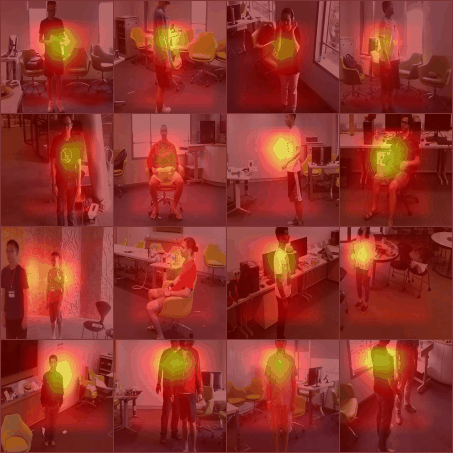
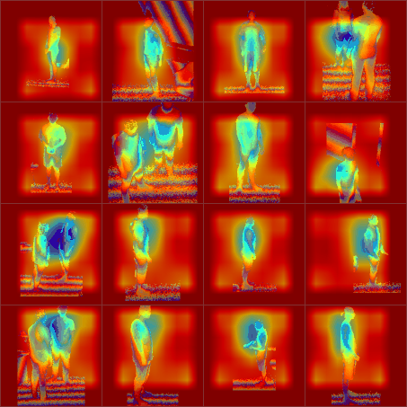
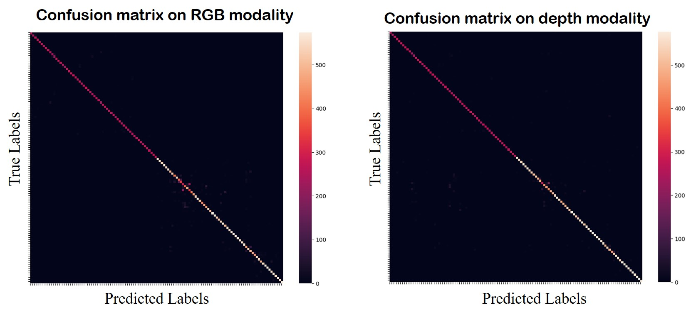

# [[TPAMI](https://ieeexplore.ieee.org/abstract/document/10122710/)] A Unified Multimodal *De-* and *Re*-coupling Framework for RGB-D Motion Recognition 

<a href="https://pytorch.org/get-started/locally/"></a>  [](https://arxiv.org/abs/2211.09146)

This repo is the official implementation of "A Unified Multimodal *De-* and *Re*-coupling Framework for RGB-D Motion Recognition" as well as the follow-ups. It is an extension of the [CVPR'23](https://github.com/damo-cv/MotionRGBD/) paper. It currently includes code and models for the following tasks:
> **RGB-D-based Action Recognition**: Included in this repo.

> **RGB-D-based Gesture Recognition**: Included in this repo.

>**Video data augementation**: Included in this repo. See the ShuffleMix+ strategy in this paper.

## News
***2023/10/06***

1. This method achieved the 4th in the [ICIAP Multimodal Action Recognition Competition](https://iplab.dmi.unict.it/MECCANO/challenge.html).
   
***2023/07/29***

1. Uploaded the training results on the [NTU-RGBD-120](https://paperswithcode.com/paper/ntu-rgbd-120-a-large-scale-benchmark-for-3d) dataset.
   
***2023/06/20***

1. Add dataset split files.
2. Fixed some bugs.
3. Update README.

## Attention Visualization
<p align="center">
       
    
   
   * Visualization of the class activation responses for RGB and depth modalities.
</p>

## 1. Performance
<p align="center">
   
  <!--  -->

</p>

<p align="center">
   
  
  The proposed method (UMDR) outperforms a number of state-of-the-art methods on both action and gesture datasets.
</p>

## 2. Requirements
This is a PyTorch implementation of our paper. 
torch>=1.7.0; torchvision>=0.8.0; Visdom(optional)

Data prepare: dataset with the following folder structure:

```
│NTURGBD/
├──dataset_splits/
│  ├── @CS
│  │   ├── train.txt
                video name               total frames    label
│  │   │    ├──S001C001P001R001A001_rgb      103          0 
│  │   │    ├──S001C001P001R001A004_rgb      99           3 
│  │   │    ├──...... 
│  │   ├── valid.txt
│  ├── @CV
│  │   ├── train.txt
│  │   ├── valid.txt
├──ImagesResize/
│  │   ├── S001C002P001R001A002_rgb
│  │   │   ├──000000.jpg
│  │   │   ├──000001.jpg
│  │   │   ├──......
├──nturgb+d_depth_masked/
│  │   ├── S001C002P001R001A002
│  │   │   ├──MDepth-00000000.png
│  │   │   ├──MDepth-00000001.png
│  │   │   ├──......
```
NOTE: We use the NTU dataset’s high-resolution RGB video (1280x960). To avoid losing infoemation, we do not resize the video frames directly to 320x240. Instead, we crop a 640x480 ROI area for each frame using the realeased mask images. Then we resize the cropped area to 320x240 for training and testing. See data/data_preprose_for_NTU.py for the data preprocessing codes.

## 3. Methodology
<p align="center">
  
  
</p>
 We propose to decouple and recouple spatiotemporal representation for RGB-D-based motion recognition. The Figure in the first line illustrates the proposed multi-modal spatiotemporal representation learning framework. The Figure in the second line shows the learning of decoupling and multi-stage recoupling saptiotemporal representation from a unimodal data.

## 4. Train and Evaluate
We pre-trained all of our models on the [20BN Jester V1 dataset](https://www.kaggle.com/toxicmender/20bn-jester), except for NTU-RGBD. Alternatively, one can use the parameters trained on NTU-RGBD to initialize the model before training on other datasets, such as IsoGD, NvGesture and THU-READ.

### Unimodal Training
Take training an RGB model with 8 GPUs on the NTU-RGBD dataset as an example,

```bash
# type: M(rgb), K(depth); sample-duration: the length of the video clip;  smprob: hyperparameter  $\rho$; mixup: hyperparameter  $\alpha_{m}$; shufflemix: $\alpha_{s}$; intar-fatcer: Controls the temporal resolution of each sub-branch in DTN (default: set 2 when sample-duration=16/32;  set 4 when sample-duration=64).

python -m torch.distributed.launch --nproc_per_node=8 --master_port=1234 --use_env train.py --config config/NTU.yml --data /path/to/Dataset/NTU-RGBD/frames --splits /path/to/Dataset/NTU-RGBD/dataset_splits/@CS/ --save ./output_dir/ --batch-size 16  --sample-duration 32 \
--opt sgd \
--lr 0.01 \
--sched cosine \
--smprob 0.2 --mixup 0.8 --shufflemix 0.3 --epochs 100 --distill 0.2 --type M --intar-fatcer 2 
```

Take training an RGB model with 8 GPUs on the IsoGD dataset as an example,

```bash
python -m torch.distributed.launch --nproc_per_node=8 --master_port=1234 --use_env train.py --config config/IsoGD.yml --data /path/to/Dataset/IsoGD/frames --splits ./data/dataset_splits/IsoGD/rgb/ --save ./output_dir/ --batch-size 16  --sample-duration 32 \
--opt sgd \
--lr 0.01 \
--sched cosine \
--smprob 0.2 --mixup 0.8 --shufflemix 0.3 --epochs 100 --distill 0.2 --type M --intar-fatcer 2 \
--finetune ./Checkpoints/NTU-RGBD-32-DTNV2-TSM/model_best.pth.tar
```

### Cross-modal Fusion
```bash
# scc-depth: number of CFCer used in spatial domain. tcc-depth: number of CFCer used in temporal domain.
python -m torch.distributed.launch --nproc_per_node=8 --master_port=1234 --use_env train_fusion.py --config config/NTU.yml --data /path/to/Dataset/NTU-RGBD/frames --splits /path/to/Dataset/NTU-RGBD/dataset_splits/@CS/ --save ./output_dir/ --batch-size 16 --sample-duration 32 \
--smprob 0.2 --mixup 0.8 --shufflemix 0.3 --epochs 100 --distill 0.0 --intar-fatcer 2 \
--FusionNet cs32 --lr 0.01 --sched step --opt sgd --decay-epochs 10 --scc-depth 2 --tcc-depth 4
```

### Evaluation
```bash
python -m torch.distributed.launch --nproc_per_node=8 --master_port=1234 --use_env train.py --config config/NTU.yml --data /path/to/Dataset/NTU-RGBD/frames --splits /path/to/Dataset/NTU-RGBD/dataset_splits/@CS/  --batch-size 16 --sample-duration 32 --eval_only --resume /path/to/model_best.pth.tar 
```
## 5. Models Download
<table>
  <tr>
    <th>Dataset</th>
    <th>Modality</th>
    <th>#Frames</th>
    <th>Accuracy</th>
    <th>Download</th>
  </tr> 
   <tr>
    <td>NTU-RGBD(CS)</td>
    <td>RGB</td>
    <td>16/32/64</td>
    <td>92.0/92.2/92.9</td>
    <td><a href="https://drive.google.com/drive/folders/1z0pvQlN31I4aKTaCDKbAmkwT7WO29MTO?usp=sharing">Google Drive</a></td>
  </tr>
    <tr>
    <td>NTU-RGBD(CS)</td>
    <td>Depth</td>
    <td>16/32/64</td>
    <td>94.5/94.8/95.0</td>
    <td><a href="https://drive.google.com/drive/folders/1z0pvQlN31I4aKTaCDKbAmkwT7WO29MTO?usp=sharing">Google Drive</a></td>
  </tr>
  <tr>
    <td>NTU-RGBD(CS)</td>
    <td>RGB-D</td>
    <td>16/32/64</td>
    <td>95.6/95.9/96.2</td>
    <td><a href="https://drive.google.com/drive/folders/1z0pvQlN31I4aKTaCDKbAmkwT7WO29MTO?usp=sharing">Google Drive</a></td>
  </tr>
  
  <tr>
    <td>NTU-RGBD(CV)</td>
    <td>RGB</td>
    <td>16/32/64</td>
    <td>95.3/95.8/96.3</td>
    <td><a href="https://drive.google.com/drive/folders/1z0pvQlN31I4aKTaCDKbAmkwT7WO29MTO?usp=sharing">Google Drive</a></td>
  </tr>
    <tr>
    <td>NTU-RGBD(CV)</td>
    <td>Depth</td>
    <td>16/32/64</td>
    <td>95.4/95.9/96.5</td>
    <td><a href="https://drive.google.com/drive/folders/1z0pvQlN31I4aKTaCDKbAmkwT7WO29MTO?usp=sharing">Google Drive</a></td>
  </tr>
    <tr>
    <td>NTU-RGBD(CV)</td>
    <td>RGB-D</td>
    <td>16/32/64</td>
    <td>97.5/97.8/98.0</td>
    <td><a href="https://drive.google.com/drive/folders/1z0pvQlN31I4aKTaCDKbAmkwT7WO29MTO?usp=sharing">Google Drive</a></td>
  </tr>

  </tr>
    <tr>
    <td>NTU-RGBD-120(CS)</td>
    <td>RGB</td>
    <td>16/32/64</td>
    <td>-/89.8/-</td>
    <td><a href="https://drive.google.com/drive/folders/1z0pvQlN31I4aKTaCDKbAmkwT7WO29MTO?usp=sharing">Google Drive</a></td>
  </tr>
  </tr>
    <tr>
    <td>NTU-RGBD-120(CS)</td>
    <td>Depth</td>
    <td>16/32/64</td>
    <td>-/92.6/-</td>
    <td><a href="https://drive.google.com/drive/folders/1z0pvQlN31I4aKTaCDKbAmkwT7WO29MTO?usp=sharing">Google Drive</a></td>
  </tr>
  
  <tr>
    <td>IsoGD</td>
    <td>RGB</td>
    <td>16/32/64</td>
    <td>60.6/63.7/64.4</td>
    <td><a href="https://drive.google.com/drive/folders/1uhZS9QlYIMSH9d_2rfutC1UK3YBt8Teu?usp=sharing">Google Drive</a></td>
  </tr>
  <tr>
    <td>IsoGD</td>
    <td>Depth</td>
    <td>16/32/64</td>
    <td>63.4/64.6/65.5</td>
    <td><a href="https://drive.google.com/drive/folders/1uhZS9QlYIMSH9d_2rfutC1UK3YBt8Teu?usp=sharing">Google Drive</a></td>
  </tr>
  <tr>
    <td>IsoGD</td>
    <td>RGB-D</td>
    <td>16/32/64</td>
    <td>69.2/72.6/72.7</td>
    <td><a href="https://drive.google.com/drive/folders/1uhZS9QlYIMSH9d_2rfutC1UK3YBt8Teu?usp=sharing">Google Drive</a></td>
  </tr>
</table>

# Citation
```
@ARTICLE{zhou2023umdr,
  author={Zhou, Benjia and Wang, Pichao and Wan, Jun and Liang, Yanyan and Wang, Fan},
  journal={IEEE Transactions on Pattern Analysis and Machine Intelligence}, 
  title={A Unified Multimodal De- and Re-Coupling Framework for RGB-D Motion Recognition}, 
  year={2023},
  pages={1-15},
  doi={10.1109/TPAMI.2023.3274783}}
```
# LICENSE
The code is released under the MIT license.
# Copyright
Copyright (C) 2010-2021 Alibaba Group Holding Limited.
